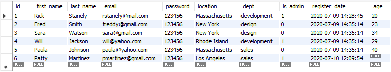
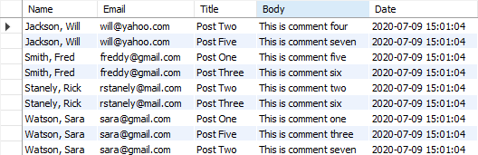

# acme-database
Generates and stores data for company messages.

Created using MySQL.

1. Table of user information.
```sql
SELECT * FROM users
```



2. Formatted join table.
```sql
CONCAT(users.last_name, ', ', users.first_name) AS "Name",
users.email AS 'Email',
posts.title AS 'Title',
comments.body AS 'Body',
posts.publish_date AS 'Date'
FROM comments
INNER JOIN posts on posts.id = comments.post_id
INNER JOIN users on users.id = comments.user_id
ORDER BY last_name;
```



# What I Learned
- How to create tables
- How to alter and update tables
- How to select specific data
- How to join tables
